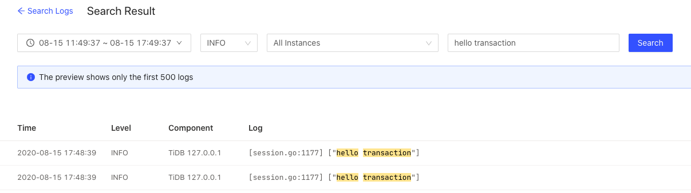

Homework 1

根据tidb快速上手指南，使用playground部署一个本地测试环境
```
tiup playground --db 1 --pd 1 --kv 3 --monitor
```

clone tidb的源码到本地。根据我对transaction的理解以及对第一次作业要求的理解，我认为应该在[session.go中的runStmt函数](https://github.com/pingcap/tidb/blob/c5c7bf87bbc355248c7f3933bdacacb76a5843ff/session/session.go#L1176)中加入一行代码输出要求的log
```
logutil.Logger(ctx).Info("hello transaction")
```

修改完成后，重新编译tidb，生成binary。重新部署本地测试环境
```
tiup playground --db 1 --pd 1 --kv 3 --monitor --db.binpath "bin/tidb-server"
```

部署完成后，在mysql console中测试本次改动，输入任意mysql语句，然后在dashboard中搜索相应的log。

